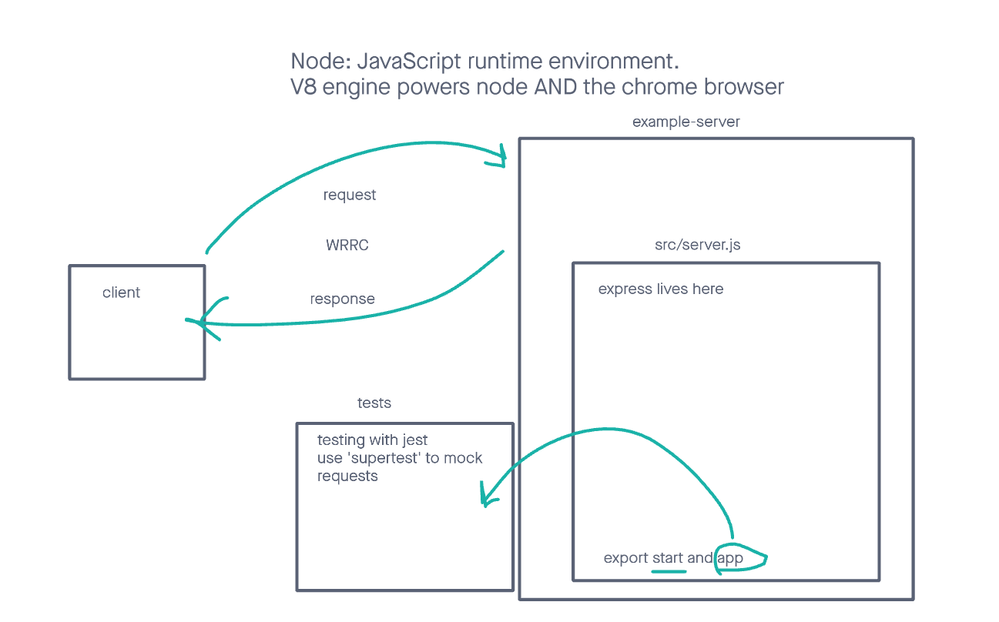

# LAB - Class 01

## Project: server-deployment-practice

### Author: Reece Renninger

### Problem Domain  

This is a very basic express server is used as a base for CI/CD deployment exercises

### Links and Resources

- [GitHub Actions ci/cd](https://github.com/ReeceRenninger/server-deployment-practice)
- [back-end dev server url](https://example-server-dev-n25u.onrender.com) (when applicable)
- [back-end prod server url](https://server-deployment-prod-ge0p.onrender.com) (when applicable)

### Collaborators

- Ryan Gallaway provided the demo code that we were allowed to use today

### Setup

#### `.env` requirements (where applicable)

port variable exists within the env sample

#### How to initialize/run your application (where applicable)

clone repo, 'npm i', then run 'nodemon' in the terminal

#### How to use your library (where applicable)

#### Routes
<!-- all routes should be documented -->
- GET : `/` - proof of life endpoint
- GET : `/success` - specific route to hit
- GET : `/bad` - specific route to hit to signify if an error is encountered
- USE : `*` - catch all for not found

#### Tests

to run tests, after running 'npm i', run the command 'npm test'

#### UML

